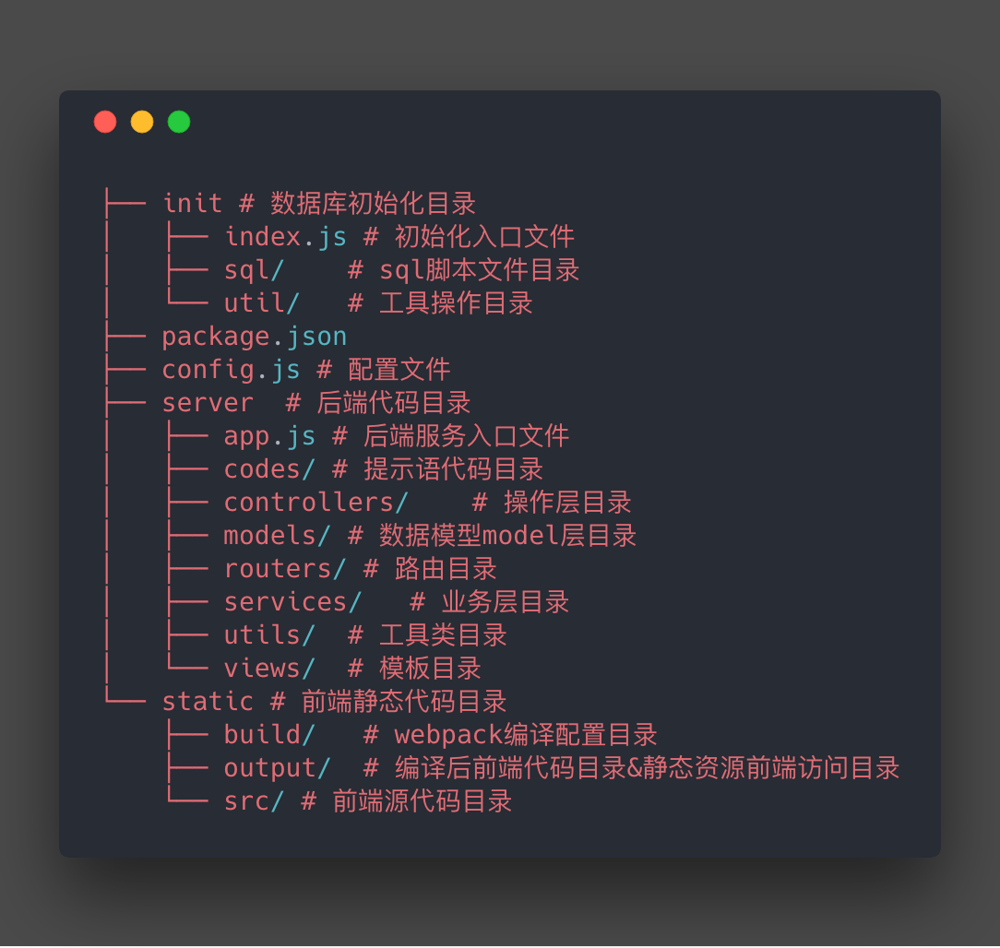
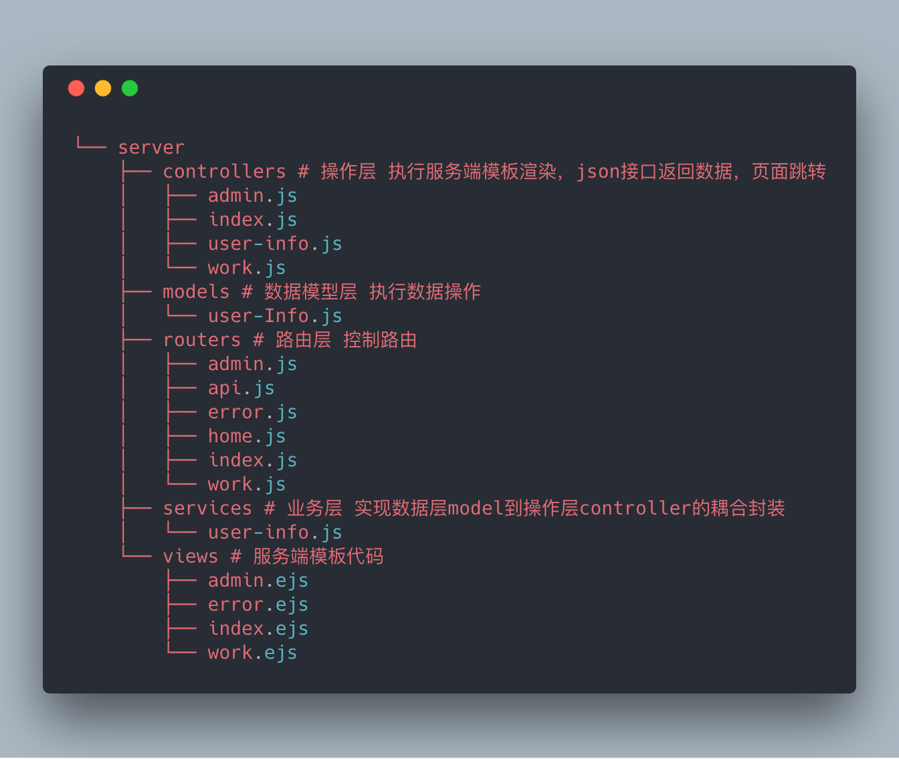
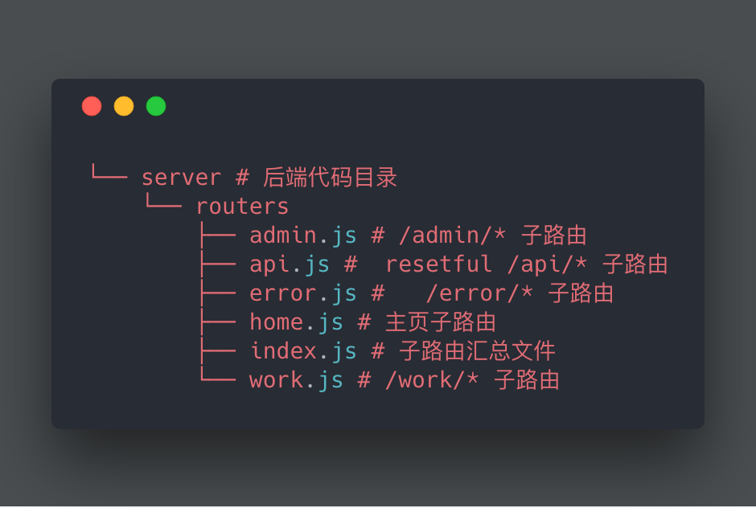
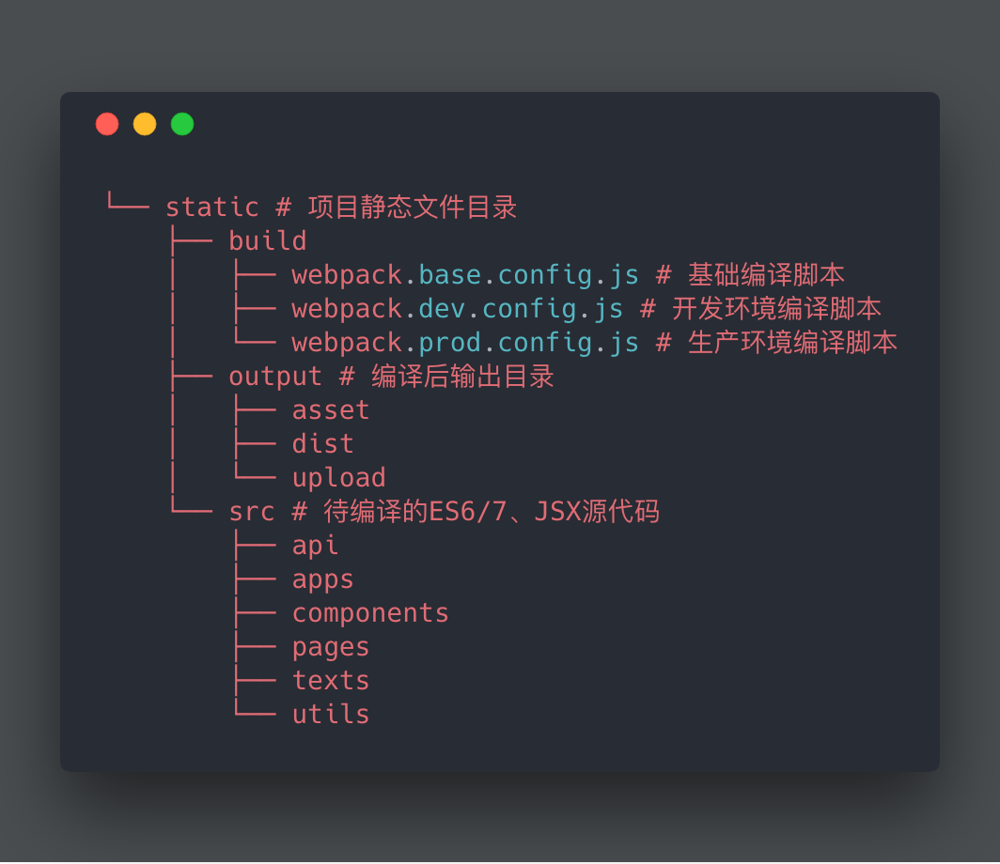
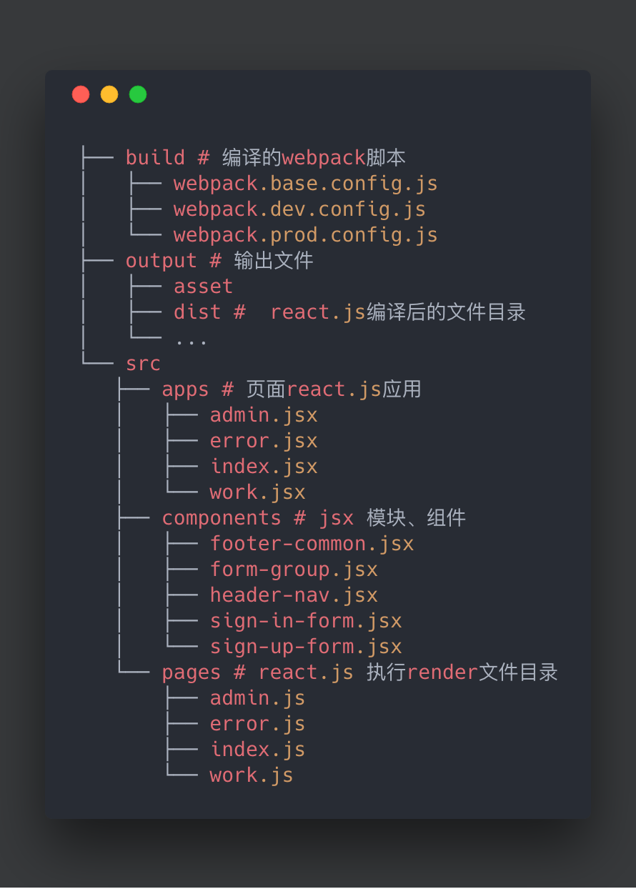

# koa-project

## 分层设计

### 后端代码目录

#### 路由目录

### 前端文件目录

#### 前端src目录

- [koa-project](#koa-project)
  - [分层设计](#)
    - [后端代码目录](#)
      - [路由目录](#)
    - [前端文件目录](#)
      - [前端src目录](#src)